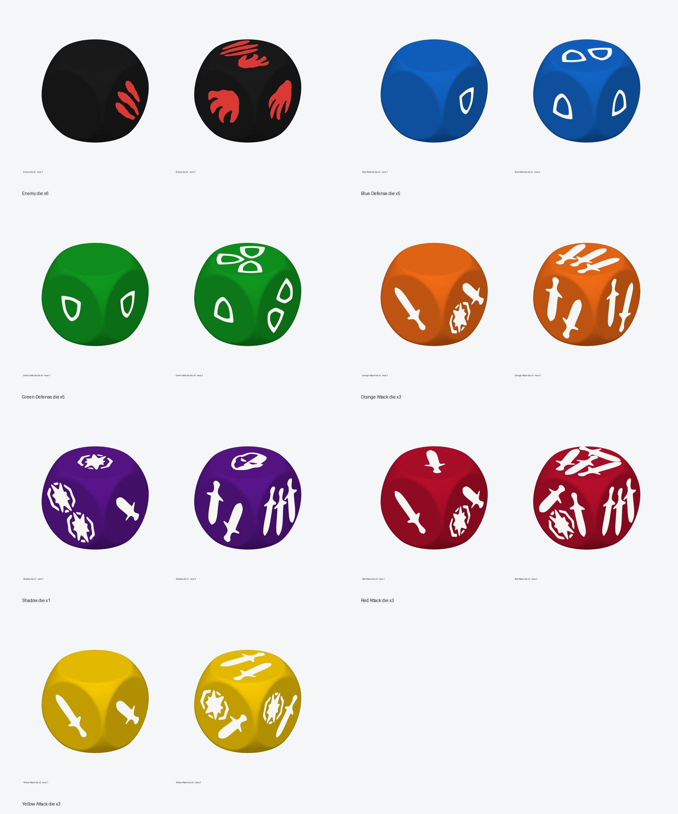

# Massive Darkness 2 Hellscape Dice Assets

Fan-made custom dice assets for **Massive Darkness 2: Hellscape**, built as reproducible SVG and 3MF files for personal 3D printing.



## What Is Included

- Curated SVG symbols in `assets/svg/`.
- Generated slicer-ready dice in `build/3mf/`.
- Individual dice files in `build/3mf/individual/`.
- Preview renders in `docs/previews/`.
- Source references and the blank die mesh in `source/`.
- A Python CLI in `src/md2_dice/`.

## Repository Layout

- `assets/svg/`: maintained 16 mm SVG symbols used as build inputs.
- `assets/svg/elements/`: reusable symbol elements.
- `build/3mf/`: generated 3MF dice files, committed for convenience.
- `build/3mf/individual/`: one 3MF file per die color.
- `docs/previews/`: generated preview images.
- `source/`: original references and `base_die.3mf`.
- `src/md2_dice/`: CLI and generation code.
- `pyproject.toml` and `uv.lock`: Python project metadata managed with `uv`.

## Quick Start

Install dependencies from the repository root:

```bash
uv sync
```

Run the full generation pipeline:

```bash
uv run md2-dice all
```

Validate the SVG inputs without rebuilding everything:

```bash
uv run md2-dice validate
```

## CLI Commands

- `uv run md2-dice validate`: validate the curated SVGs in `assets/svg/`.
- `uv run md2-dice svgs`: regenerate source-trace SVG candidates and validate the curated SVGs.
- `uv run md2-dice build`: regenerate the 3MF files in `build/3mf/`.
- `uv run md2-dice previews`: regenerate preview images in `docs/previews/`.
- `uv run md2-dice all`: run SVG regeneration, validation, 3MF generation, and previews.

The final SVGs in `assets/svg/` are curated build inputs. Debug/source-trace output is kept under `assets/svg/_debug/` so the printable assets stay stable.

## Dice Set

- Black: Enemy die x6.
- Blue: Blue Defense die x5.
- Green: Green Defense die x5.
- Orange: Orange Attack die x3.
- Yellow: Yellow Attack die x3.
- Red: Red Attack die x3.
- Purple: Shadow die x1.

## Printing

Start with the individual 3MF files in `build/3mf/individual/` before printing the full set. Open them in Bambu Studio or another slicer that supports multi-object 3MF files.

Each die is split into body and symbol objects so you can assign filaments in the slicer. Symbols are intended to be white on every die except the black Enemy die, where the symbols are red.

For the black die, use the current print-optimized 3MF with a `0.4 mm` nozzle. It is tuned to preserve the small dark gaps between the red claw marks.

## License

Code is licensed under the MIT License. See `LICENSE`.

SVG symbols, source/reference images, generated previews, and generated 3MF files are fan-made assets intended for personal, non-commercial use. See `ASSETS_LICENSE.md`.

This project is not affiliated with the publisher or rights holders of Massive Darkness 2.
